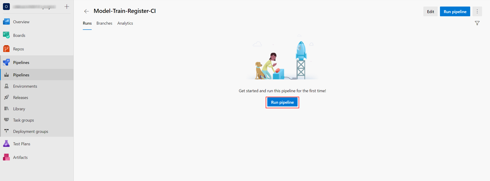

# Solliance Labs - Azure Machine Learning Model Operationalization

This lab covers MLOps using Azure DevOps and GitHub, training and deployment of models, real time scoring using a REST API endpoint.

## Task 1 - Explore lab scenario

The high-level steps covered in the lab are:

- Configure the Azure DevOps project and required variable group
- Create an Azure DevOps Service Connection for the Azure ML Workspace
- Import the starter GitHub repository
- Set up Build, Release Trigger, and Release Multi-Stage Pipelines
- Set up the Release Deployment pipeline
- Explore results in the Azure Machine Learning workspace

## Task 2 - Configure the Azure DevOps project and required variable group

1. Open the [Azure DevOps portal](https://dev.azure.com/) and select the **Sign in to Azure DevOps** link. If the `We need a few more details` screen appears, leave the default values and select `Continue`.
   
    

2. To sign-in, use the Azure credentials provided by the lab environment.
   
3. Locate your Azure DevOps project, and select it. The name of the project should be `AE MLOps 0N`, where N is the same number as the one you have in your user name provided as part of the lab credentials.
   
   

4. The environment requires some variables to be set before you can run any pipelines. At this step, you'll create a variable group in Azure DevOps to store values that are reused across multiple pipeline stages. Navigate to **Pipelines**, **Library** and in the **Variable groups** section select **+ Variable group** as indicated bellow.

   

5. To prepare the values you'll need to set all your variables, you need to get the resource group location where all your Azure resources were provisioned. In another browser tab, navigate to the [Azure portal](https://portal.azure.com), sign in with the provided Azure credentials if you are asked to, and navigate to the lab Resource group. On the resourge group overview page, you'll find the location information you need.
   
      

6. Going back to the Azure Devops portal where you created the Variable group for you DevOps project, enter the **Variable group name**: `devopsforai-aml-vg`.
   
7. Add the required list of variables, using the **+ Add** link at the bottom of the **Variables** section as illustrated in the image bellow:

    

    Use values simialr to the ones listed in the table:

    | Variable Name            | Suggested Value           | Short description                                                                                                           |
    | ------------------------ | ------------------------- | --------------------------------------------------------------------------------------------------------------------------- |
    | BASE_NAME                | [your project name] e.g. `user4-project`     | Unique naming prefix for created resources - max 10-15 chars, letters and numbers only, should include `userN` where N is the same number as the one you have in your user name provided as part of the lab credentials.                                         |
    | LOCATION                 | `centralus`                 | Resource group location (the value you looked for on the previous step). You must use the key form, without caps and spaces (e.g. `Central US` -> `centralus`).                             |
    | RESOURCE_GROUP           | `User4AML`                | Azure Resource Group name (the value you looked for on the previous step).                                                                                                   |
    | WORKSPACE_NAME           | `user4aml`             | Azure ML Workspace name (the value you looked for on the previous step).                           |
    | WORKSPACE_SVC_CONNECTION | `aml-workspace-connection`  | [Azure ML Workspace Service Connection](#create-an-azure-devops-azure-ml-workspace-service-connection) name (use the exact name mentioned here).                 |
    | ACI_DEPLOYMENT_NAME      | `mlops-aci`                 | [Azure Container Instances](https://azure.microsoft.com/en-us/services/container-instances/) name (use the exact name mentioned here).                           |                 |

8. Make sure you select the **Allow access to all pipelines** checkbox in the variable group configuration.

    

9. Select **Save** from the top menu to create the variable group.

    

## Task 3 - Create an Azure DevOps Service Connection for the Azure ML Workspace

Create a new service connection to your Azure ML Workspace to enable executing the Azure ML training pipeline. The connection name needs to match WORKSPACE_SVC_CONNECTION that you set in the variable group above (eg. `aml-workspace-connection`).

1. Go to **Project settings**, **Service connections** and select **Create service connection** as illustrated bellow.

    

2. Select the connection type from the available list: **Azure Resource Manager** and select **Next**.

    

3. Provide the authentication method: **Service principal (automatic)** and move **Next**.
    

4. Select scope level: **Machine Learning Workspace** and select the available **Subscription**, **Resource group** and **Machine Learning Workspace** provided in the lab environment.

    >**IMPORTANT**
    >
    >Make sure you select the correct resource group and Machine Learning workspace (in case the dropdown lists have multiple options).

    Enter `aml-workspace-connection` for the **Service connection name** and select **Save**.

    
    
    >Note: 
    >
    >Creating a service connection with Azure Machine Learning workspace scope requires 'Owner' or 'User Access Administrator' permissions on the Workspace. You'll need sufficient permissions to register an application with your Azure AD tenant, or you can get the ID and secret of a service principal from your Azure AD Administrator. That principal must have Contributor permissions on the Azure ML Workspace.

## Task 4 - Import the starter GitHub repository

1. Go to the [Solliance Labs GitHub portal](https://github.com/solliancelabs) and sign in with the Git credentials provided for you.

2. If you are asked to verify your account, so you should open your user's mailbox on https://outlook.live.com/ to be able to receive the verification codes for Github authentication. Use the same Github user account credentials to open Outlook.
   
3. In Github, while authenticated with the lab user, navigate to the following link to create a new git repository from the provided template:
   https://github.com/solliancenet/labs-ae-mlops-starter/generate.

4. Set the repository name to `mlops_0N` (where N is the same number as the one you have in your user name provided as part of the lab credentials) and select **Create repository from template**.

    >**IMPORTANT**:
    >
    >Make sure you are creating the new repo in the `solliancelabs` GitHub tenant and the name is `mlops_0N`, where N is the same number as the one you have in your user name provided as part of the lab credentials.

    

## Task 5 - Set up Build, Release Trigger, and Release Multi-Stage Pipelines

Now that you've provisioned all the required Azure resources and service connections, you can set up the pipelines for training (CI) and deploying (CD) your machine learning model to production. Additionally, you can set up a pipeline for batch scoring.
In the following steps you will create and run a new build pipeline based on the `diabetes_regression-ci.yml` pipeline definition in your imported repository.
   
1. In your Azure DevOps project summary page, navigate to the **Pipelines** section from the left navigation menu. Select **Create Pipeline**.

    

2. Select the code location: **Azure Repos Git**.
   
    

3. In case Azure Pipelines were not yet authorized to your account, you need to do that. To authorize Azure Pipelines on your GitHub repository, select `Authorize AzurePipelines`. If Azure Pipelines are already authorized, you will not see this screen.

    

4. In case Azure Pipelines were not yet approved and installed for your repository, you need to do that. To approve, install, and request Azure Pipelines for your repository, select `Only select repositories`, ensure only your repository is selected (should be, by default), and then select `Approve, Install, & Request`.If Azure Pipelines are already approved and installed for your repository, you wil not see this screen.

    

5. Select the Git repository you created in the previous task: `mlops_0N` (where N is the same number as the one you have in your user name provided as part of the lab credentials).
   
    

6. In the **Configure pipeline** step, select the **Existing Azure Pipelines YAML file**.
   
    

7. Leave the default branch selected and paste the path to the YAML file: `/.pipelines/diabetes_regression-ci.yml`. Select **Continue**.

    

8. In the **Review** step, take a moment to observe the code inside the YAML file and then expand the **Run** menu and select **Save**.
   
    

9. With the created pipeline, select **Rename/move** from the right menu as illustrated bellow:

    

10. Change the pipeline name to: `Model-Train-Register-CI` and select **Save**.

    

11. Run the pipeline by selecting the **Run pipeline** button. Leave the default values on the next dialog and hit **Run**.

    

12. Wait for the pipeline run to complete (it can take up to 20-25 minutes for the pipeline to finish).

    >**IMPORTANT**:
    >
    >Head back to the main discussion room while the pipeline is running. We will run an architectural discussion until the pipeline finishes.

    

13. Once the pipeline is finished, check the execution result. Expand the **Train and evaluate model stage** from the **Expand stage** button. 
    
    

14. Also you should inspect the artifact of the training stage:

    

15. Next, open a new browser tab and sign in to the [Azure Portal](https://portal.azure.com) with the Azure credentials provided in the lab. Open the available Resource Group, locate and select the Machine Learning workspace that was pre-created in the lab environment.

    

16. Select **Launch studio** to navigate to the **Azure Machine Learning Studio**.
    
17. In the [Azure Machine Learning Studio](https://ml.azure.com), select **Pipelines** from the left navigation menu, go to **Pipeline endpoints** and check the published training pipeline in the `ai-in-a-day-XXXXXX` workspace.

    

    Great, you now have the build pipeline for training set up which automatically triggers every time there's a change in the master branch! After the pipeline is finished, you'll see a new model in the ML Workspace.

18. Navigate to the **Models** section in ML Studio, using the left navigation menu and check the newly registered model named `diabetes_regression_model.pkl`.

    

## Task 6 - Set up the Release Deployment pipeline

The release deployment and batch scoring pipelines have the following behaviors:

 - The pipeline will automatically trigger on completion of the Model-Train-Register-CI pipeline for the master branch.
 - The pipeline will default to using the latest successful build of the Model-Train-Register-CI pipeline. It will deploy the model produced by that build.
 - You can specify a Model-Train-Register-CI build ID when running the pipeline manually. You can find this in the url of the build, and the model registered from that build will also be tagged with the build ID. This is useful to skip model training and registration, and deploy/score a model successfully registered by a Model-Train-Register-CI build.

1. Open the Azure DevOps portal and sign in with the Azure credentials provided for you in the lab environment.

2. In your current organization, open your Azure DevOps project summary page and navigate to the **Pipelines** section from the left navigation menu. Select **New Pipeline**.

    

3. Select the code location: **GitHub**.
   
    

4. Select your Git repository : `mlops_0N` (where N is the same number as the one you have in your user name provided as part of the lab credentials).
   
    

5. In the **Configure pipeline** step, select the **Existing Azure Pipelines YAML file**.
   
    

6. Leave the default branch selected and paste the path to the YAML file: `/.pipelines/diabetes_regression-cd.yml`. Select **Continue**.

    

7. In the **Review** step, take a moment to observe the code inside the YAML file and then expand the **Run** menu and select **Save**.

    

8. With the created pipeline, select **Rename/move** from the right menu as illustrated bellow:

    

9. Change the pipeline name to: `Model-Deploy-CD` and select **Save**.

    

10. Run the pipeline by selecting the **Run pipeline** button. Leave the default values on the next dialog and hit **Run**. Wait for the pipeline run to complete (it can take up to 10-15 minutes for the pipeline to finish).

    >**IMPORTANT**:
    >
    >Head back to the main discussion room while the pipeline is running. We will run an architectural discussion until the pipeline finishes.

    

11. Your first run will use the latest model created by the Model-Train-Register-CI pipeline. Once the pipeline is finished, check the execution result. 
   
    

12. Once your pipeline run begins, you can see the model name and version downloaded from the `Model-Train-Register-CI` pipeline.

    

    The pipeline has the following stages:

    - Deploy to ACI
        - Deploy the model to the QA environment in Azure Container Instances.
        - Smoke test
            - The test sends a sample query to the scoring web service and verifies that it returns the expected response. Have a look at the smoke [test code](https://github.com/solliancenet/ae-mlops-starter/blob/master/ml_service/util/smoke_test_scoring_service.py) for an example.
    - Deploy to AKS (not run as part of this lab)

## Task 7 - Explore results in the Azure Machine Learning workspace

1. Open a new browser tab and sign in to the [Azure Portal](https://portal.azure.com) with the Azure credentials provided in the lab. Open the available Resource Group, locate and select the Machine Learning workspace that was pre-created in the lab environment.

    

2. Select **Launch studio** to navigate to the **Azure Machine Learning Studio**.

3. Explore the Azure Machine Learning workspace to identify the results of the pipeline. Select `Endpoints` from the left menu, then select `Real-time enpoints`, and then select the `mlops-aci` deployment.

    

4. Inspect the various properties of the deployed ACI endpoint.

    
